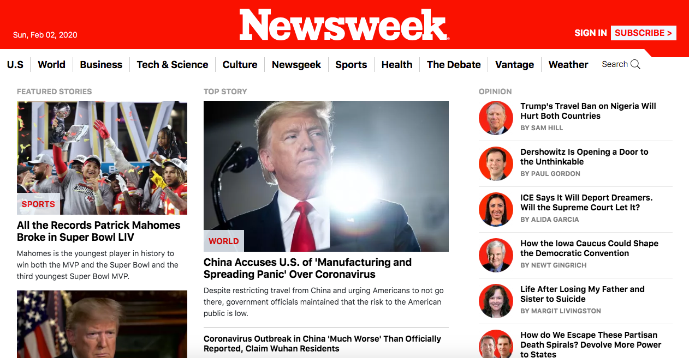
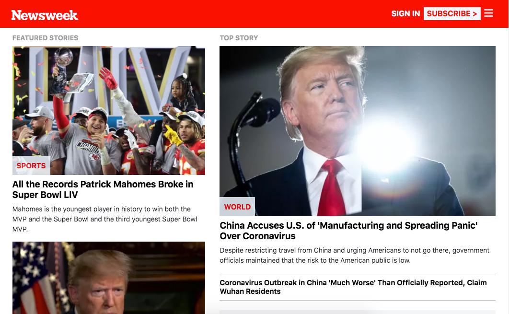
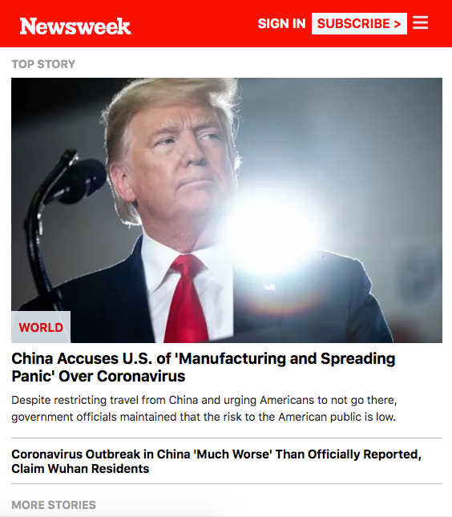

# NewsWeek Clone

> This is the most actual newsweek page up to date clone, which I developed on my own using pure HTML and CSS combined with the bootstrap framework and a little bit of JS to make the header stick on the laptop view. I suggested to name it NewsWeek Clone. This project is responsive to latop, tablet and mobile resolutions. 

# Latop View

# Tablet View

# Mobile View

## Built With

- HTML
- CSS
- Bootstrap 4
- Flexbox

## Live Demo

[Live Demo Link](https://rawcdn.githack.com/xtrmdarc/newsweek_clone/55268f7e63d0734df2c42e9d5fe1f34b9fa3ef89/index.html)

### Prerequisites
To make this repository working in your local machine you need only a browser.

## Authors

👤 **Diego Antonio Reyes Coronado**

- Github: [@githubhandle](https://github.com/xtrmdarc)
- Twitter: [@twitterhandle](https://twitter.com/DiegoAn91629127)
- Linkedin: [linkedin](https://www.linkedin.com/in/diego-reyes-coronado-7a7189b7/)

## 🤝 Contributing

Contributions, issues and feature requests are welcome!

Feel free to check the [issues page](https://github.com/xtrmdarc/newsweek_clone/issues).

## Show your support

Give a ⭐️ if you like this project!

## License

This project is [MIT](lic.url) licensed.
